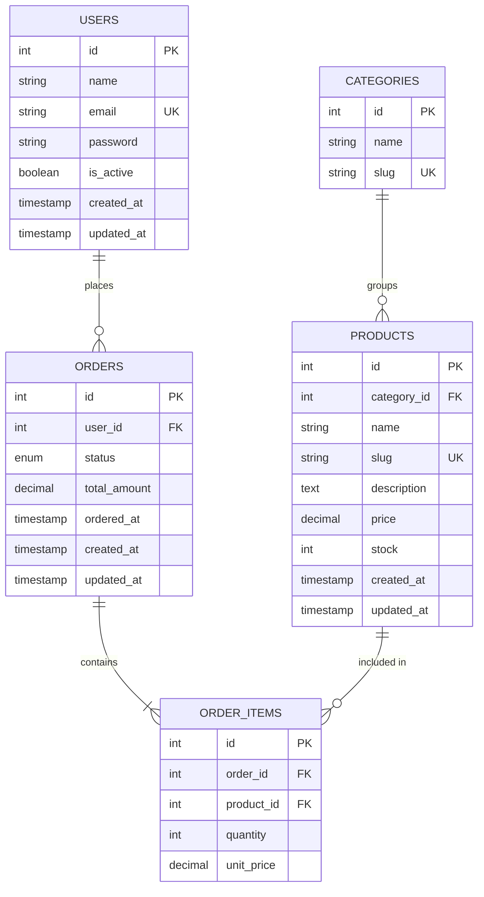
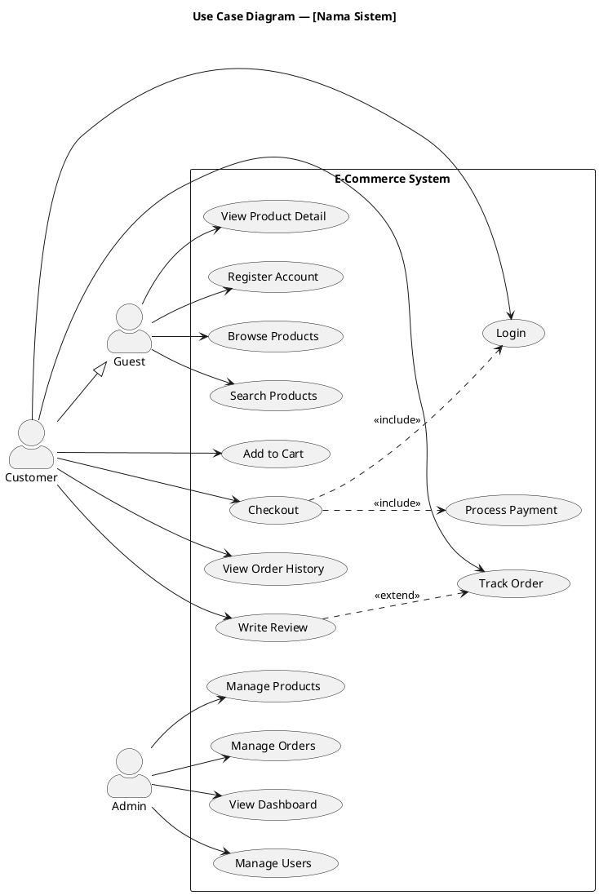
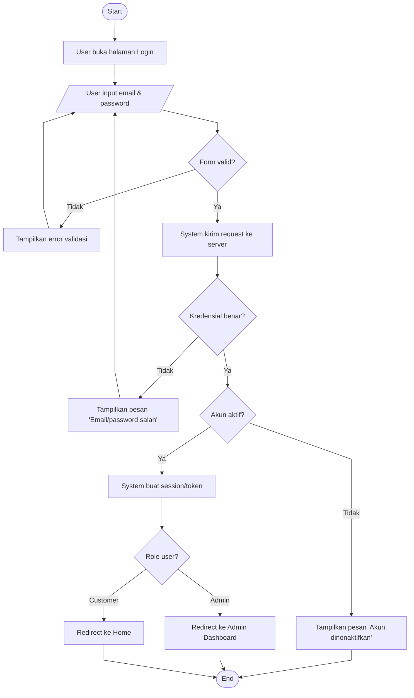
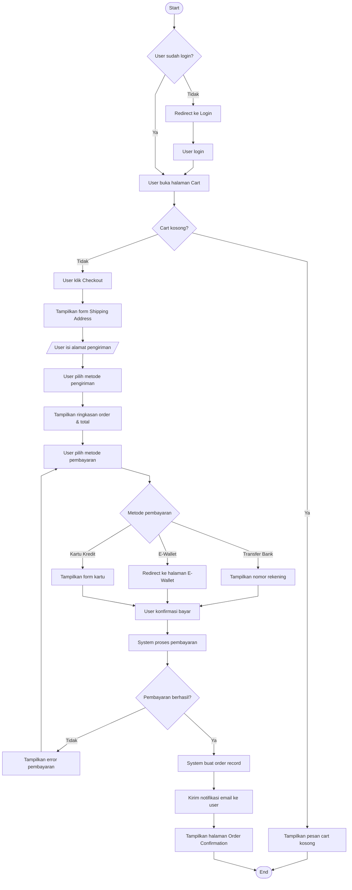

# 🤖 AGENT CONTEXT — Diagram Generator

> Letakkan file ini di root project kamu.
> File ini memberikan konteks kepada AI agent agar dapat menghasilkan **ERD**, **Use Case Diagram**, dan **User Flow** yang akurat, konsisten, dan langsung bisa digunakan.

---

## 📌 Tujuan File Ini

File ini adalah **konteks tunggal** yang harus dibaca agent sebelum menghasilkan diagram apapun dalam project ini. Berisi:
- Konvensi & standar yang dipakai di project
- Cara membaca struktur project
- Aturan output per jenis diagram
- Template siap pakai
- Contoh output yang diharapkan

---

## 🗂️ Struktur Project (Isi Sesuai Project Kamu)

```
project-root/
├── src/
│   ├── models/          # Entity / schema definisi
│   ├── controllers/     # Business logic
│   ├── routes/          # API endpoints
│   └── services/        # Service layer
├── database/
│   └── migrations/      # Skema database aktual
├── docs/
│   └── diagrams/        # Output diagram disimpan di sini
├── AGENT_CONTEXT.md     # ← file ini
└── README.md
```

> **Instruksi Agent**: Sebelum membuat diagram, baca folder `src/models/` dan `database/migrations/` untuk memahami entitas yang ada. Jika tidak ada, tanyakan ke user atau inferensikan dari kode yang ada.

---

## 🧠 Cara Agent Harus Bekerja

### Langkah Wajib Sebelum Generate Diagram

1. **Pahami domain** — Baca README.md dan file model/schema yang ada
2. **Identifikasi entitas** — Daftar semua tabel/model beserta atributnya
3. **Identifikasi aktor** — Siapa saja pengguna sistem? (Admin, User, Guest, dll)
4. **Identifikasi relasi** — One-to-many, many-to-many, dll
5. **Identifikasi alur utama** — Apa saja fitur/flow kritis dalam sistem?
6. **Konfirmasi dulu** — Jika ada yang tidak jelas, tanyakan sebelum generate

### Prinsip Output

- **Akurat** → diagram harus mencerminkan kode/schema yang benar-benar ada
- **Lengkap** → tidak ada entitas/relasi penting yang terlewat
- **Readable** → nama jelas, tidak disingkat sembarangan
- **Konsisten** → gunakan konvensi yang sama di semua diagram

---

## 📊 ERD (Entity Relationship Diagram)

### Standar yang Digunakan

Gunakan **Crow's Foot Notation** (standar paling umum dan mudah dibaca).

### Konvensi Penamaan

| Elemen | Format | Contoh |
|--------|--------|--------|
| Nama tabel | `snake_case`, plural | `users`, `order_items` |
| Primary key | `id` (integer/uuid) | `id INT PK` |
| Foreign key | `{tabel_singular}_id` | `user_id`, `product_id` |
| Timestamp | selalu ada | `created_at`, `updated_at` |
| Boolean | prefix `is_` atau `has_` | `is_active`, `has_verified` |
| Soft delete | gunakan `deleted_at` | `deleted_at TIMESTAMP NULL` |

### Tipe Data yang Digunakan

```
INT / BIGINT     → ID, angka
VARCHAR(n)       → teks pendek (nama, email, slug)
TEXT             → teks panjang (deskripsi, konten)
DECIMAL(10,2)    → harga, nilai desimal
BOOLEAN          → true/false
TIMESTAMP        → tanggal & waktu
DATE             → tanggal saja
ENUM(...)        → nilai terbatas (status, tipe)
JSON             → data fleksibel
UUID             → ID unik global
```

### Template ERD (Mermaid)



### Aturan Relasi ERD

```
||--||   → One to One (wajib - wajib)
||--o|   → One to One (wajib - opsional)
||--o{   → One to Many
||--|{   → One to Many (wajib)
}o--o{   → Many to Many
```

### Checklist ERD

- [ ] Semua tabel memiliki `id` sebagai PK
- [ ] Semua FK tercantum di entitas yang benar (sisi "many")
- [ ] Label relasi menggunakan kata kerja (places, contains, belongs to)
- [ ] Tipe data konsisten dan masuk akal
- [ ] Tidak ada atribut yang redundan antar tabel
- [ ] Tabel pivot untuk many-to-many sudah dibuat

---

## 🎭 Use Case Diagram

### Standar yang Digunakan

Format **PlantUML** atau **Mermaid** (pilih sesuai tools yang tersedia). Jika manual, gunakan deskripsi terstruktur.

### Konvensi

| Elemen | Aturan |
|--------|--------|
| Aktor | Nama dalam **Title Case**, adalah peran bukan orang (`Admin`, `Customer`, `Guest`) |
| Use Case | Diawali **kata kerja** (`View Product`, `Process Payment`) |
| Include | Digunakan untuk sub-fungsi yang **wajib** dilakukan |
| Extend | Digunakan untuk sub-fungsi yang **opsional/kondisional** |
| Sistem boundary | Label dengan nama sistem yang jelas |

### Template Use Case (PlantUML)



### Template Use Case (Mermaid — alternatif)

```
Jika tools tidak mendukung PlantUML, gunakan format deskriptif terstruktur:

## Use Cases

### Aktor: Guest
- UC-001: Browse Products
- UC-002: Search Products  
- UC-003: View Product Detail
- UC-004: Register Account

### Aktor: Customer (includes semua Guest use cases)
- UC-005: Login / Logout
- UC-006: Manage Cart (Add, Update, Remove)
- UC-007: Checkout → <<include>> UC-008
- UC-008: Process Payment
- UC-009: Track Order
- UC-010: Write Product Review → <<extend>> UC-003

### Aktor: Admin
- UC-101: Manage Products (CRUD)
- UC-102: Manage Orders (View, Update Status)
- UC-103: View Analytics Dashboard
- UC-104: Manage Users (View, Ban, Verify)
```

### Checklist Use Case

- [ ] Semua aktor sudah teridentifikasi (termasuk sistem eksternal jika ada)
- [ ] Setiap use case diawali kata kerja
- [ ] Relasi `<<include>>` dan `<<extend>>` digunakan dengan benar
- [ ] Tidak ada use case yang terlalu granular (satu action = satu use case, bukan satu klik)
- [ ] Hierarki aktor sudah benar (inheritance jika ada)
- [ ] Sistem boundary jelas

---

## 🔄 User Flow

### Standar yang Digunakan

**Flowchart** menggunakan Mermaid `flowchart TD` (top-down) atau `flowchart LR` (left-right untuk flow panjang).

### ⚠️ WAJIB — Garis Lurus (Orthogonal Lines)

Selalu tambahkan init config berikut di **awal setiap flowchart** agar garis antar shape lurus (tidak melengkung):

```
%%{init: {"flowchart": {"curve": "linear"}} }%%
```

> Tanpa ini, Mermaid akan render garis melengkung (bezier curve) secara default. Wajib ada di semua diagram flowchart tanpa pengecualian.

### Konvensi

| Shape | Makna | Mermaid Syntax |
|-------|-------|----------------|
| Kotak biasa `[ ]` | Langkah / aksi | `A[Langkah]` |
| Berlian `{ }` | Decision / kondisi | `B{Kondisi?}` |
| Oval / Rounded `([ ])` | Start / End | `C([Start])` |
| Parallelogram `[/ /]` | Input / Output | `D[/Input Data/]` |
| Silinder | Database | `E[(Database)]` |

### Aturan Penamaan Node

```
Gunakan format: [Aktor] [Kata Kerja] [Objek]
Contoh:
- "User klik tombol Login"
- "System validasi kredensial"
- "Admin approve pesanan"
```

### Template User Flow — Login



### Template User Flow — Checkout



### Checklist User Flow

- [ ] Ada node Start dan End yang jelas
- [ ] Setiap decision node (diamond) punya minimal 2 cabang
- [ ] Happy path (alur sukses) mudah diikuti secara visual
- [ ] Error/edge case sudah dihandle (validasi gagal, tidak login, dll)
- [ ] Tidak ada dead end (semua cabang berujung ke End atau kembali ke langkah)
- [ ] Aktor dibedakan dengan label di node (User / System / Admin)
- [ ] Flow tidak terlalu panjang — jika lebih dari 20 node, pecah menjadi sub-flow
- [ ] **Init config `curve: linear` sudah ada** di baris pertama setiap flowchart

---

## 📋 Cara Meminta Diagram ke Agent

Gunakan format prompt berikut untuk hasil terbaik:

### Prompt ERD

```
Berdasarkan AGENT_CONTEXT.md dan struktur project ini, buatkan ERD untuk fitur [nama fitur].

Entitas yang terlibat: [daftar entitas jika sudah diketahui]
Tools output: [Mermaid / PlantUML / draw.io XML]
```

### Prompt Use Case

```
Berdasarkan AGENT_CONTEXT.md, buatkan Use Case Diagram untuk sistem [nama sistem].

Aktor: [daftar aktor]
Fitur utama: [daftar fitur]
Format output: [PlantUML / deskripsi terstruktur]
```

### Prompt User Flow

```
Berdasarkan AGENT_CONTEXT.md, buatkan User Flow untuk alur [nama alur].

Aktor utama: [siapa yang melakukan aksi]
Entry point: [dari mana user memulai]
Success state: [apa yang terjadi jika berhasil]
Error case: [apa yang bisa gagal]
Format output: [Mermaid flowchart]
```

---

## 🛠️ Tools & Format Output

| Diagram | Format Rekomendasi | Tools |
|---------|-------------------|-------|
| ERD | Mermaid `erDiagram` | VS Code + Mermaid Preview, GitHub, Notion |
| ERD | dbdiagram.io DSL | dbdiagram.io (export PNG/PDF) |
| Use Case | PlantUML | PlantUML Online, VS Code Extension |
| User Flow | Mermaid `flowchart` | VS Code + Mermaid Preview, GitHub, Notion |
| Semua | draw.io XML | draw.io / diagrams.net |

### Cara Render Mermaid di GitHub

Wrap kode dengan triple backtick + `mermaid`:

````
```mermaid
erDiagram
    ...
```
````

---

## ⚠️ Hal yang TIDAK Boleh Dilakukan Agent

- ❌ Mengarang entitas/tabel yang tidak ada di codebase
- ❌ Menggunakan singkatan tidak standar (`usr`, `prod`, `ord`)
- ❌ Membuat relasi tanpa dasar dari kode atau schema
- ❌ Melewatkan atribut penting (PK, FK, status, timestamp)
- ❌ Membuat diagram terlalu besar tanpa memecahnya per domain
- ❌ Menggunakan format output yang tidak diminta
- ❌ Generate tanpa membaca context project terlebih dahulu
- ❌ **Membuat flowchart tanpa init config `curve: linear`** — garis wajib lurus, tidak boleh melengkung

---

## ✅ Definition of Done — Diagram

Diagram dianggap **selesai dan valid** jika:

1. **ERD**: Semua entitas relevan ada, relasi benar, atribut lengkap dengan tipe data
2. **Use Case**: Semua aktor teridentifikasi, semua fitur utama tercakup, include/extend benar
3. **User Flow**: Happy path jelas, semua edge case dihandle, tidak ada dead end
4. **Semua**: Dapat di-render tanpa error di tools target, mudah dibaca tanpa penjelasan tambahan

---

*File ini dibuat untuk memandu AI agent dalam menghasilkan diagram yang akurat dan konsisten. Update file ini setiap kali ada perubahan signifikan pada arsitektur atau konvensi project.*
