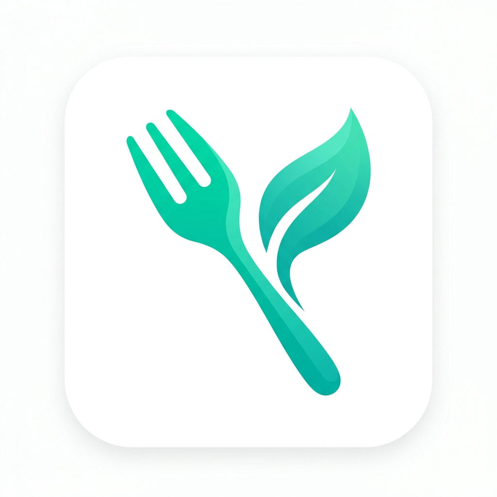

# 🥗 NutriMove — Smart AI Nutrition Assistant

<p align="center">
  
</p>

<p align="center">
  <strong>Asisten Nutrisi Pintar Berbasis AI dan Gamifikasi untuk Hidup Lebih Sehat</strong>
</p>

<p align="center">
  
  
  
  
</p>

---

## 📝 Deskripsi Aplikasi

**NutriMove** adalah aplikasi asisten nutrisi cerdas berbasis mobile yang dirancang untuk membantu pengguna mengontrol pola makan, memantau asupan gizi harian, dan membangun kebiasaan hidup sehat dengan cara yang menyenangkan. 

Dengan menggabungkan kecanggihan **Google Gemini AI** untuk analisis makanan berbasis gambar dan **Gamifikasi (Streak & Achievements)**, NutriMove mengubah proses pencatatan kalori yang biasanya membosankan menjadi petualangan interaktif yang memotivasi pengguna setiap hari.

Aplikasi ini menggunakan pendekatan **Offline-First Hybrid AI**; secara instan mencocokkan gambar atau input makanan dengan database gizi lokal Indonesia secara offline untuk menghemat kuota, dan secara otomatis beralih ke analisis **Gemini 3.5 Flash** online saat mendeteksi hidangan unik atau baru.

---

## ✨ Fitur Utama

### 📸 1. AI Food Scanner & NutriGrade
* **Hybrid Food Recognition**: Pindai makanan Anda secara instan menggunakan kamera atau galeri. Menggunakan algoritma pemindaian lokal untuk respon instan (<5ms) dan Gemini Vision API sebagai analisis mendalam.
* **NutriGrade System**: Memberikan penilaian gizi makanan secara otomatis (Grade A sampai D) berdasarkan kandungan makronutrisi (protein, lemak, karbohidrat, dan kalori) untuk membantu Anda memilih makanan yang lebih sehat.
* **Portion Size Estimator**: Sesuaikan porsi makanan secara dinamis menggunakan slider interaktif untuk menghitung ulang nilai gizi secara presisi.

### 📊 2. Daily Calories & Macro Tracker
* **Interactive Dashboard**: Pantau total kalori harian yang dikonsumsi dengan progress bar melingkar yang intuitif dan reaktif.
* **Macronutrient Tracking**: Analisis harian untuk asupan Protein, Karbohidrat, dan Lemak secara real-time.
* **Weekly Report**: Laporan riwayat gizi mingguan dalam bentuk grafik visual yang indah didukung oleh `fl_chart`.

### 🤖 3. NutriBot (Asisten Chat AI)
* **AI-Powered Nutritionist**: Konsultasikan rencana diet, hitung kalori resep masakan, atau tanyakan tips kesehatan langsung ke NutriBot yang ditenagai oleh Gemini AI.
* **Markdown Rendering Support**: Jawaban dari bot diformat dengan sangat rapi dan mudah dibaca (mendukung list, bold text, headers, dll.).
* **Quick Suggestion Chips**: Memulai percakapan secara instan dengan rekomendasi topik siap pakai.

### 🏆 4. Gamification & Streak System
* **Daily Streaks**: Bangun kebiasaan mencatat makanan setiap hari untuk mempertahankan dan meningkatkan jumlah Streak beruntun Anda.
* **Achievements & Badges**: Buka berbagai lencana pencapaian menarik seperti *First Scan*, *7-Day Streak*, hingga lencana elit *NutriMaster*.

### ⚙️ 5. Personalization & Settings
* **Diet Goals**: Personalisasikan target kalori harian Anda berdasarkan profil fisik dan tujuan kesehatan (menurunkan, mempertahankan, atau menaikkan berat badan).
* **Allergen Alert**: Tandai alergen pribadi (seperti kacang, seafood, atau susu) agar aplikasi dapat mendeteksi bahan berbahaya pada makanan yang Anda pindai.

---

## 🛠️ Teknologi yang Digunakan

Aplikasi NutriMove dibangun menggunakan ekosistem teknologi modern berikut:

* **Framework Utama**: [Flutter (Dart SDK ^3.11.0)](https://flutter.dev)
* **State Management**: [Provider](https://pub.dev/packages/provider) — Manajemen state reaktif yang bersih dan efisien.
* **Navigasi**: [GoRouter](https://pub.dev/packages/go_router) — Sistem routing deklaratif untuk navigasi antar halaman.
* **AI & Machine Learning**: 
  * [Google Generative AI](https://pub.dev/packages/google_generative_ai) — Integrasi model Gemini 3.5 Flash untuk analisis gambar makanan dan asisten chat.
* **Backend & Cloud Database**:
  * [Firebase Core](https://pub.dev/packages/firebase_core) & [Firebase Auth](https://pub.dev/packages/firebase_auth) — Sistem otentikasi pengguna yang aman (Email & Google Sign-In).
  * [Cloud Firestore](https://pub.dev/packages/cloud_firestore) — Database real-time cloud untuk sinkronisasi data log makanan dan profil pengguna.
* **Penyimpanan Lokal**: [Shared Preferences](https://pub.dev/packages/shared_preferences) — Penyimpanan persisten lokal untuk preferensi pengguna, data streak offline, dan cache prestasi.
* **Library UI & Grafik**:
  * [Google Fonts (Outfit & Inter)](https://pub.dev/packages/google_fonts) — Tipografi modern dan premium.
  * [FL Chart](https://pub.dev/packages/fl_chart) — Visualisasi grafik laporan mingguan yang dinamis.
  * [Flutter Markdown](https://pub.dev/packages/flutter_markdown) — Rendering konten chat AI berformat markdown.

---

## 📱 Screenshot Aplikasi

> *Catatan: Silakan masukkan file screenshot aplikasi Anda ke direktori yang sesuai (misal: `assets/screenshots/`) dan sesuaikan path di bawah ini.*

<table align="center">
  <tr>
    <td align="center" width="30%">
      <sub><b>Splash & Onboarding</b></sub><br/>
      
    </td>
    <td align="center" width="30%">
      <sub><b>Login & Register</b></sub><br/>
      
    </td>
    <td align="center" width="30%">
      <sub><b>Dashboard Utama</b></sub><br/>
      
    </td>
  </tr>
  <tr>
    <td align="center" width="30%">
      <sub><b>AI Food Scanner</b></sub><br/>
      
    </td>
    <td align="center" width="30%">
      <sub><b>NutriBot (Chat AI)</b></sub><br/>
      
    </td>
    <td align="center" width="30%">
      <sub><b>Achievements & Profile</b></sub><br/>
      
    </td>
  </tr>
</table>

---

## 🚀 Cara Menjalankan

Ikuti langkah-langkah di bawah ini untuk memasang dan menjalankan proyek NutriMove di perangkat lokal Anda.

### 📋 Prasyarat

Pastikan Anda telah memasang perangkat lunak berikut:
* [Flutter SDK](https://docs.flutter.dev/get-started/install) (versi 3.11.0 atau lebih baru)
* [Dart SDK](https://dart.dev/get-started)
* Android Studio / Xcode (untuk emulator)
* Git

### 🔧 Langkah Instalasi

1. **Clone repositori ini:**
   ```bash
   git clone https://github.com/username/nutrimove.git
   cd nutrimove
   ```

2. **Dapatkan dependensi proyek:**
   ```bash
   flutter pub get
   ```

3. **Konfigurasi Firebase:**
   * Buat proyek baru di [Firebase Console](https://console.firebase.google.com).
   * Daftarkan aplikasi Android dan iOS Anda.
   * Unduh file `google-services.json` (untuk Android) dan tempatkan di `android/app/`.
   * Unduh file `GoogleService-Info.plist` (untuk iOS) dan tempatkan di `ios/Runner/`.
   * Aktifkan layanan **Authentication** (Email/Password & Google Sign-In) serta **Cloud Firestore**.

4. **Konfigurasi API Key Gemini:**
   * Dapatkan API Key Gemini Anda dari [Google AI Studio](https://aistudio.google.com).
   * Tambahkan API Key tersebut ke dalam file konfigurasi lingkungan aplikasi Anda di `lib/core/config/env_config.dart` (atau konfigurasikan sesuai petunjuk keamanan environment Anda):
     ```dart
     // Contoh pengisian API Key
     class EnvConfig {
       static const String geminiApiKey = 'ISI_API_KEY_GEMINI_ANDA_DI_SINI';
     }
     ```

5. **Jalankan Aplikasi:**
   * Pastikan emulator Anda sedang berjalan atau hubungkan perangkat fisik Anda.
   * Jalankan perintah:
     ```bash
     flutter run
     ```

---

<p align="center">
  Made with ❤️ by <b>NutriMove Team</b>
</p>
