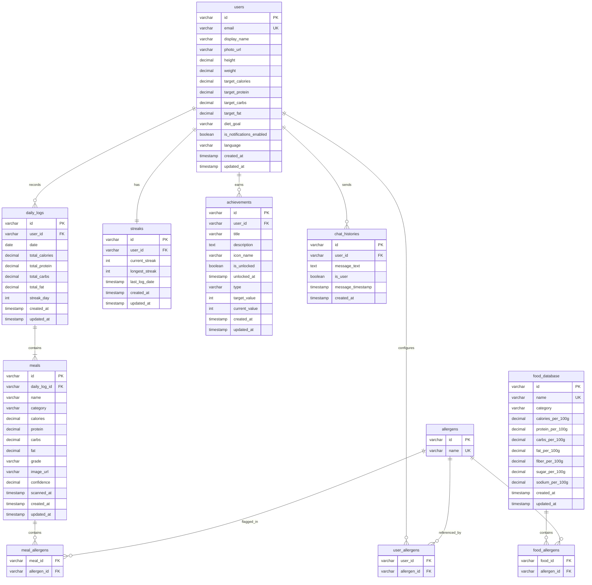

# Entity Relationship Diagram (ERD) — NutriMove

Dokumen ini memuat Entity Relationship Diagram (ERD) untuk proyek **NutriMove**. ERD ini dimodelkan menggunakan standar **Crow's Foot Notation** relasional penuh untuk menggambarkan bagaimana data disimpan di Firestore (terpetakan secara logis ke struktur relasional) dan model lokal aplikasi.

## Deskripsi Entitas & Pemetaan Bidang

### 1. `users`
Menyimpan data profil utama pengguna NutriMove. Kolom target makronutrisi (`target_calories`, `target_protein`, `target_carbs`, `target_fat`) diisi berdasarkan tujuan diet (`diet_goal`) dan data fisik (`height`, `weight`).

### 2. `daily_logs`
Menyimpan riwayat gizi harian yang dikonsumsi oleh pengguna. Document ID pada Firestore dipetakan sebagai format tanggal ISO 8601 (`YYYY-MM-DD`). Berisi agregasi kalori dan makronutrisi dari makanan yang disantap pada hari tersebut.

### 3. `meals`
Menyimpan rincian setiap makanan yang dimakan oleh pengguna. Entitas ini terhubung ke `daily_logs` melalui `daily_log_id`. Menampung metadata AI hasil pemindaian seperti `confidence` dan `grade` (A/B/C/D).

### 4. `streaks`
Menyimpan data gamifikasi streak harian pengguna. Setiap pengguna memiliki satu baris data streak yang melacak `current_streak` dan `longest_streak`.

### 5. `achievements`
Menyimpan daftar pencapaian/lencana (*badges*) yang dapat diraih pengguna. Melacak progress (`current_value` terhadap `target_value`) dan status keterbukaannya (`is_unlocked`).

### 6. `chat_histories`
Menyimpan riwayat percakapan pengguna dengan **NutriBot AI**.

### 7. `food_database`
Tabel master gizi makanan Indonesia (read-only bagi pengguna) yang digunakan sebagai referensi pencocokan offline/hybrid.

### 8. `allergens` (dan Tabel Pivot)
Tabel master jenis alergen (misal: kacang, seafood, gluten). Hubungan antara Pengguna, Makanan, dan Database Master Makanan dengan Alergen dimodelkan secara many-to-many lewat tabel pembantu:
- `user_allergens`: Alergen yang dihindari oleh pengguna.
- `meal_allergens`: Alergen yang terdeteksi pada makanan yang dicatat pengguna.
- `food_allergens`: Alergen bawaan pada database makanan master.
