# Use Case Diagram — NutriMove

Dokumen ini menjelaskan interaksi aktor dengan berbagai fungsionalitas sistem NutriMove melalui Use Case Diagram.

## Aktor Sistem

| No | Aktor | Peran & Deskripsi |
|----|-------|-------------------|
| 1 | **Pengguna** | Aktor utama (manusia) yang mengoperasikan aplikasi mobile NutriMove. |
| 2 | **Firebase Authentication** | Aktor eksternal yang menangani proses pendaftaran, verifikasi, dan otentikasi sesi pengguna. |
| 3 | **AI / Computer Vision** | Aktor pendukung (layanan AI) untuk mengenali hidangan dari gambar (on-device TFLite / cloud Gemini Vision). |
| 4 | **NutriBot AI** | Aktor pendukung (layanan LLM Gemini & Groq) yang memproses pertanyaan chatbot dan rekomendasi diet. |
| 5 | **Firestore Database** | Aktor eksternal penyimpan data persisten (profil, logs harian, riwayat makan, pencapaian). |

## Daftar Use Case

| Kode | Use Case | Aktor Utama | Deskripsi Singkat |
|------|----------|-------------|-------------------|
| **UC-01** | Registrasi Akun | Pengguna | Mendaftar akun baru menggunakan Email & Password. |
| **UC-02** | Login | Pengguna | Masuk ke sistem untuk mengakses dashboard pribadi. |
| **UC-03** | Mengisi Health Profiling | Pengguna | Mengisi berat badan, tinggi badan, target, dan alergen saat setup profil awal. |
| **UC-04** | Melihat Dashboard | Pengguna | Memantau ringkasan kalori harian dan makronutrisi dalam bentuk progress radial. |
| **UC-05** | Scan Makanan dengan AI | Pengguna | Mengambil foto makanan atau memilih dari galeri untuk diproses oleh AI. |
| **UC-06** | Melihat Hasil Identifikasi Makanan | Pengguna | Meninjau nama makanan dan estimasi kalori/makro yang dideteksi oleh sistem AI. |
| **UC-07** | Melihat NutriGrade | Pengguna | Melihat penilaian kualitas gizi makanan (A/B/C/D) berdasarkan TOPSIS. |
| **UC-08** | Menyimpan Data Makanan | Pengguna | Menyimpan makanan yang diidentifikasi atau dicatat ke dalam log harian. |
| **UC-09** | Mencatat Makanan Manual | Pengguna | Memasukkan data nutrisi makanan secara mandiri jika tidak menggunakan kamera. |
| **UC-10** | Melihat Riwayat Makanan | Pengguna | Melihat daftar makanan yang dikonsumsi pada hari-hari sebelumnya. |
| **UC-11** | Mengedit Data Makanan | Pengguna | Mengubah porsi, nama, atau kandungan gizi makanan yang telah tercatat. |
| **UC-12** | Menghapus Data Makanan | Pengguna | Menghapus makanan yang salah dicatat dari log harian. |
| **UC-13** | Bertanya ke NutriBot | Pengguna | Berkonsultasi mengenai diet/kesehatan dengan asisten chat AI. |
| **UC-14** | Melihat Rekomendasi Makanan | Pengguna | Mendapatkan rekomendasi menu harian sehat hasil pengolahan Fuzzy AHP-TOPSIS. |
| **UC-15** | Melihat Daily Streak | Pengguna | Melihat pencapaian hari beruntun pencatatan makanan di halaman dashboard. |
| **UC-16** | Melihat Statistik Nutrisi | Pengguna | Memantau perkembangan gizi mingguan dalam bentuk grafik visual. |
| **UC-17** | Mengelola Profil | Pengguna | Mengubah informasi diri, target gizi, atau preferensi alergen. |
| **UC-18** | Logout | Pengguna | Keluar dari sesi aplikasi secara aman. |

## Diagram Use Case (Mermaid)

```mermaid
%%{init: {"flowchart": {"curve": "linear"}} }%%
flowchart LR
    %% ========== AKTOR ==========
    User(("👤 Pengguna"))
    FireAuth(("🔐 Firebase\nAuthentication"))
    AICV(("🧠 AI /\nComputer Vision"))
    NutriAI(("🤖 NutriBot\nAI"))
    Firestore(("🗄️ Firestore\nDatabase"))

    %% ========== SYSTEM BOUNDARY ==========
    subgraph NutriMove ["Sistem NutriMove"]
        direction TB

        %% Use Cases
        UC01(["UC-01: Registrasi Akun"])
        UC02(["UC-02: Login"])
        UC03(["UC-03: Mengisi Health Profiling"])
        UC04(["UC-04: Melihat Dashboard"])
        UC05(["UC-05: Scan Makanan dengan AI"])
        UC06(["UC-06: Melihat Hasil Identifikasi Makanan"])
        UC07(["UC-07: Melihat NutriGrade"])
        UC08(["UC-08: Menyimpan Data Makanan"])
        UC09(["UC-09: Mencatat Makanan Manual"])
        UC10(["UC-10: Melihat Riwayat Makanan"])
        UC11(["UC-11: Mengedit Data Makanan"])
        UC12(["UC-12: Menghapus Data Makanan"])
        UC13(["UC-13: Bertanya ke NutriBot"])
        UC14(["UC-14: Melihat Rekomendasi Makanan"])
        UC15(["UC-15: Melihat Daily Streak"])
        UC16(["UC-16: Melihat Statistik Nutrisi"])
        UC17(["UC-17: Mengelola Profil"])
        UC18(["UC-18: Logout"])

        %% Include Nodes
        INC_SimpanUser([Simpan Data Pengguna])
        INC_VerifikasiKred([Verifikasi Kredensial])
        INC_SimpanProfil([Simpan Profil Kesehatan])
        INC_IdentifikasiMkn([Identifikasi Makanan])
        INC_EstimasiNutrisi([Estimasi Nutrisi])
        INC_UpdateDash([Update Dashboard])
        INC_UpdateStreak([Update Daily Streak])
        INC_FetchRiwayat([Ambil Data Riwayat Makanan])
        INC_AnalisisProfil([Analisis Profil Kesehatan])

        %% Extend Nodes
        EXT_WarnAllergen([Peringatan Alergen])
        EXT_RecAlternative([Rekomendasi Alternatif Makanan])
        EXT_WarnCalorie([Peringatan Kalori Berlebih])
        EXT_WarnGGL([Peringatan Gula/Garam/Lemak Tinggi])
        EXT_EditProfil([Edit Profil Kesehatan])
        EXT_SaranPersonal([Saran Makanan Personal])
    end

    %% ========== PENGGUNA -> USE CASES ==========
    User --> UC01
    User --> UC02
    User --> UC03
    User --> UC04
    User --> UC05
    User --> UC06
    User --> UC07
    User --> UC08
    User --> UC09
    User --> UC10
    User --> UC11
    User --> UC12
    User --> UC13
    User --> UC14
    User --> UC15
    User --> UC16
    User --> UC17
    User --> UC18

    %% ========== USE CASES -> AKTOR PENDUKUNG / SISTEM EXTERNAL ==========
    UC01 -.-> FireAuth
    UC02 -.-> FireAuth
    UC18 -.-> FireAuth

    UC05 -.-> AICV
    UC06 -.-> AICV

    UC13 -.-> NutriAI
    UC14 -.-> NutriAI

    UC03 -.-> Firestore
    UC08 -.-> Firestore
    UC10 -.-> Firestore
    UC11 -.-> Firestore
    UC12 -.-> Firestore
    UC16 -.-> Firestore
    UC17 -.-> Firestore

    %% ========== HUBUNGAN INCLUDE ==========
    UC01 -->|include| INC_SimpanUser
    UC02 -->|include| INC_VerifikasiKred
    UC03 -->|include| INC_SimpanProfil
    UC05 -->|include| INC_IdentifikasiMkn
    UC05 -->|include| INC_EstimasiNutrisi
    UC08 -->|include| INC_UpdateDash
    UC08 -->|include| INC_UpdateStreak
    UC16 -->|include| INC_FetchRiwayat
    UC14 -->|include| INC_AnalisisProfil

    %% ========== HUBUNGAN EXTEND ==========
    EXT_WarnAllergen -.->|extend| UC05
    EXT_RecAlternative -.->|extend| UC07
    EXT_WarnCalorie -.->|extend| UC04
    EXT_WarnGGL -.->|extend| UC04
    EXT_EditProfil -.->|extend| UC17
    EXT_SaranPersonal -.->|extend| UC13
```

## Relasi Ketergantungan Use Case

### 1. Relasi Include (Kewajiban Alur)
Relasi `<<include>>` menandakan use case penyerta wajib dijalankan ketika use case utama dipicu.

| Use Case Utama | Use Case Penyerta (Include) | Deskripsi Rationale |
|----------------|-----------------------------|---------------------|
| **UC-01: Registrasi Akun** | Simpan Data Pengguna | Setelah mendaftar ke Firebase Auth, sistem wajib menyimpan record user ke Firestore. |
| **UC-02: Login** | Verifikasi Kredensial | Proses login mengharuskan Firebase Auth memverifikasi kecocokan email & password. |
| **UC-03: Mengisi Health Profiling** | Simpan Profil Kesehatan | Profil fisik (Tinggi/Berat Badan) yang dimasukkan wajib disimpan ke profil pengguna. |
| **UC-05: Scan Makanan dengan AI** | Identifikasi Makanan | Proses pemindaian kamera mutlak memerlukan sistem untuk mengenali jenis masakan. |
| **UC-05: Scan Makanan dengan AI** | Estimasi Nutrisi | Setelah teridentifikasi, kalori dan makronutrisi makanan tersebut wajib dihitung. |
| **UC-08: Menyimpan Data Makanan** | Update Dashboard | Setiap kali makanan baru disimpan, total asupan di halaman dashboard wajib diperbarui. |
| **UC-08: Menyimpan Data Makanan** | Update Daily Streak | Menyimpan log harian memicu pembaruan dan pertambahan streak berturut-turut. |
| **UC-16: Melihat Statistik Nutrisi** | Ambil Data Riwayat Makanan | Grafik mingguan memerlukan pembacaan data log dari database historis. |
| **UC-14: Melihat Rekomendasi Makanan** | Analisis Profil Kesehatan | Rekomendasi Fuzzy AHP-TOPSIS memerlukan pembacaan profil fisik dan alergen pengguna. |

### 2. Relasi Extend (Kondisional / Opsional)
Relasi `<<extend>>` menandakan fungsionalitas tambahan yang hanya dipicu dalam skenario atau kondisi tertentu.

| Use Case Perluasan (Extend) | Use Case Utama | Kondisi Pemicu |
|-----------------------------|----------------|----------------|
| **Peringatan Alergen** | UC-05: Scan Makanan dengan AI | Dipicu **HANYA JIKA** bahan makanan yang dideteksi AI cocok dengan daftar alergen di profil pengguna. |
| **Rekomendasi Alternatif Makanan** | UC-07: Melihat NutriGrade | Dipicu **HANYA JIKA** makanan hasil scan mendapat grade buruk (C atau D) untuk menawarkan menu pengganti yang lebih sehat. |
| **Peringatan Kalori Berlebih** | UC-04: Melihat Dashboard | Dipicu **HANYA JIKA** akumulasi kalori harian melebihi target kalori harian pengguna. |
| **Peringatan Gula/Garam/Lemak Tinggi** | UC-04: Melihat Dashboard | Dipicu **HANYA JIKA** salah satu asupan harian makro melewati ambang batas aman. |
| **Edit Profil Kesehatan** | UC-17: Mengelola Profil | Dipicu **HANYA JIKA** pengguna memutuskan untuk memperbarui berat/tinggi badan saat ini. |
| **Saran Makanan Personal** | UC-13: Bertanya ke NutriBot | Dipicu **HANYA JIKA** pengguna menanyakan rekomendasi khusus dietnya kepada chatbot AI. |
