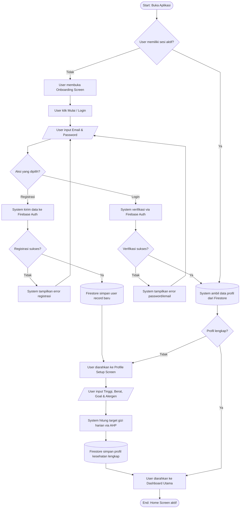
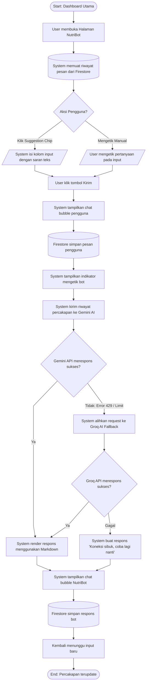

# User Flow — NutriMove

Dokumen ini mendokumentasikan alur navigasi dan interaksi pengguna di dalam aplikasi NutriMove. Untuk kemudahan pemahaman, alur dibagi menjadi tiga diagram alur utama:
1. **Alur Autentikasi & Inisialisasi Profil**
2. **Alur AI Food Scanner & Pencatatan Makanan**
3. **Alur NutriBot AI Chat**

---

## 1. Alur Autentikasi & Inisialisasi Profil

Alur ini menjelaskan langkah pertama pengguna saat membuka aplikasi hingga diarahkan ke Dashboard utama.



---

## 2. Alur AI Food Scanner & Pencatatan Makanan

Alur ini menjelaskan proses pemindaian makanan secara hybrid (lokal/Gemini) hingga data gizi tersimpan ke log harian.

```mermaid
%%{init: {"flowchart": {"curve": "linear"}} }%%
flowchart TD
    Start([Start: Dashboard Utama]) --> ClickScan[User klik tombol FAB Scan]
    ClickScan --> CaptureImage[User ambil foto makanan atau pilih galeri]
    CaptureImage --> TriggerHybrid{System jalankan hybrid scanner}
    
    TriggerHybrid -- Match Database Lokal --5ms--> CalcGrade[System hitung NutriGrade via TOPSIS]
    TriggerHybrid -- Tidak Match database lokal --> CallGemini[System kirim gambar ke Gemini Vision API]
    
    CallGemini --> GeminiCheck{AI berhasil identifikasi makanan?}
    GeminiCheck -- Tidak --> ShowAIError[System tampilkan pesan 'Makanan tidak dikenali']
    ShowAIError --> CaptureImage
    
    GeminiCheck -- Ya --> CalcGrade
    
    CalcGrade --> DisplayResult[User membuka Scan Result Screen]
    DisplayResult --> AdjustPortion{User mengubah porsi?}
    
    AdjustPortion -- Ya --> SliderAdjust[/User geser porsi slider/]
    SliderAdjust --> Recalculate[System hitung ulang kalori & makro]
    Recalculate --> DisplayResult
    
    AdjustPortion -- Tidak --> CheckAllergen{System mendeteksi alergen?}
    
    CheckAllergen -- Ya --> ShowAllergenAlert[System tampilkan Peringatan Alergen]
    ShowAllergenAlert --> ConfirmSave
    
    CheckAllergen -- Tidak --> ConfirmSave[User klik Simpan Data Makanan]
    
    ConfirmSave --> SaveToFirestore[(Firestore simpan makanan di subkoleksi meals)]
    SaveToFirestore --> UpdateTotals[(Firestore update total gizi harian daily_logs)]
    UpdateTotals --> TriggerGamification[System pemicu evaluasi streak & achievement]
    TriggerGamification --> AwardPoints[(SharedPrefs & Firestore perbarui data gamifikasi)]
    AwardPoints --> BackToDashboard[User kembali ke Dashboard Utama]
    BackToDashboard --> End([End: Dashboard terupdate])
```

---

## 3. Alur NutriBot AI Chat

Alur ini menjelaskan proses konsultasi interaktif antara pengguna dengan chatbot AI (NutriBot) yang dilengkapi sistem fallback.


