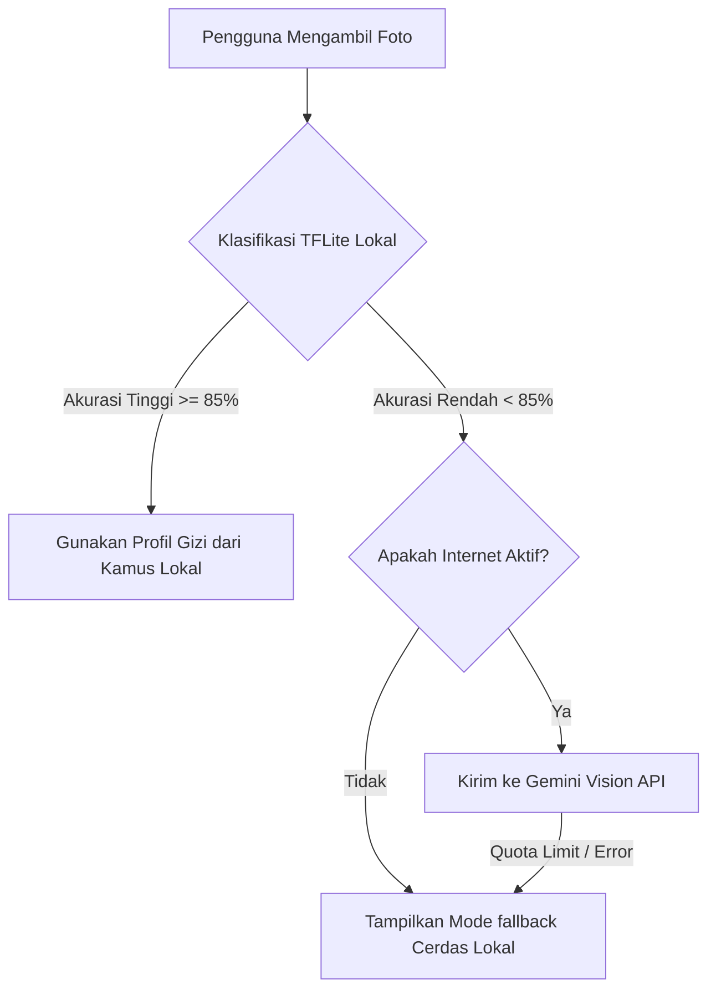

# Blueprint Optimalisasi Fitur AI Food Scanner - NutriMove

Dokumen ini berisi panduan teknis dan arsitektur strategis untuk mengembangkan fitur pemindai gizi berbasis kamera (**AI Food Scanner**) di NutriMove agar berjalan secara optimal, berkinerja tinggi, hemat biaya, dan memiliki pengalaman pengguna yang sangat premium.

---

## 1. Estimator Ukuran Porsi Dinamis (Portion Size Estimator)

### Deskripsi Masalah
Secara default, data gizi yang ditarik dari AI mengacu pada **1 porsi standar** referensi umum. Namun porsi makan riil pengguna bervariasi (misal: setengah porsi nasi atau piring dengan porsi ganda).

### Solusi Desain UI/UX & Implementasi Kode
* Menambahkan slider porsi interaktif (`Slider` widget) di dalam `ScanResultScreen` dengan rentang porsi antara `0.25x` hingga `3.00x` (dengan interval kelipatan `0.25x`).
* Saat nilai slider bergeser, hitung ulang makronutrisi dan total kalori secara reaktif:

```dart
// Rumus Skala Nutrisi Dinamis
final double multiplier = currentSliderValue; 
final double adjustedCalories = baseCalories * multiplier;
final double adjustedProtein = baseProtein * multiplier;
final double adjustedCarbs = baseCarbs * multiplier;
final double adjustedFat = baseFat * multiplier;
```

---

## 2. Autocomplete & Validasi Pencarian Kamus Lokal (Smart Offline Matching)

### Deskripsi Masalah
Jika pengguna menyunting nama makanan secara manual karena AI salah menebak, mereka berpotensi melakukan kesalahan ketik (*typo*, contoh: mengetik *"nasi grg"* bukan *"Nasi Goreng"*). Akibatnya, profil gizi tidak akan cocok dengan kamus data offline lokal.

### Solusi Desain UI/UX & Implementasi Kode
* Ganti input inline text field biasa dengan komponen **Autocomplete** atau **Search Anchor** bawaan Flutter (`TypeAhead` atau `Autocomplete` widget).
* Saat pengguna mengetik di kolom nama makanan, berikan daftar rekomendasi makanan dari basis data lokal secara instan.

```dart
Autocomplete<String>(
  optionsBuilder: (TextEditingValue textEditingValue) {
    if (textEditingValue.text.isEmpty) {
      return const Iterable<String>.empty();
    }
    return localNutritionDb.keys.where((String option) {
      return option.contains(textEditingValue.text.toLowerCase());
    });
  },
  onSelected: (String selection) {
    context.read<ScannerProvider>().updateScannedFoodName(selection);
  },
)
```

---

## 3. Penyimpanan Lokal Terstruktur Berbasis Offline-First

### Deskripsi Masalah
Kamus data gizi offline saat ini disimpan sebagai `Map` statis di dalam memori runtime. Jika aplikasi ditutup, data gizi tambahan tidak tersimpan secara permanen di tingkat lokal.

### Rekomendasi Solusi
* Mengintegrasikan database lokal super cepat dan ringan seperti **Hive** atau **Isar Database**.
* Unduh basis data gizi makanan lokal Indonesia secara teratur ketika terhubung ke internet dan simpan dalam cache lokal.
* **Keuntungan**:
  * Pencarian instan (kurang dari 5ms) tanpa jeda internet (*zero latency*).
  * Penghematan kuota data seluler pengguna.
  * Aplikasi tetap fungsional 100% meskipun berada di area susah sinyal.

---

## 4. Segmentasi & Deteksi Multi-Objek (Food Plate Segmentation)

### Deskripsi Masalah
Sebagian besar makanan khas lokal disajikan dalam satu piring dengan bermacam-macam lauk (contoh: Nasi Campur yang terdiri dari nasi putih, ayam goreng, telur balado, dan tempe). Model klasifikasi gambar standar hanya dapat mendeteksi satu label dominan.

### Solusi Jangka Panjang
* Migrasi dari tugas *Image Classification* (klasifikasi gambar tunggal) ke **Object Detection** (Deteksi Objek Multi-Lauk) menggunakan arsitektur model **YOLOv8-tiny** atau **MobileNet-SSD** yang dikompresi ke format `.tflite`.
* **Alur Deteksi**:
  1. AI menggambar kotak pembatas (*bounding box*) pada masing-masing jenis lauk di dalam piring.
  2. Mengidentifikasi setiap lauk secara mandiri.
  3. Menampilkan daftar lauk yang terdeteksi beserta kontribusi kalorinya masing-masing ke dalam daftar riwayat log piring makanan sebelum disimpan.

---

## 5. Strategi Hibrida AI Hemat Biaya (Cost & Performance Optimization)

### Skema Alur Pemrosesan AI
Untuk meminimalkan penggunaan token API berbayar (Gemini API) dan mempercepat respons aplikasi, kita dapat menerapkan pola logika berikut:



Dengan pola hibrida ini, Anda akan mendapatkan kecepatan pemindaian tingkat tinggi serta biaya infrastruktur server yang mendekati **nol rupiah** bagi mayoritas hidangan umum sehari-hari.

---

## 6. Cara Mendapatkan & Membangun Data Gizi Makanan Indonesia

Jika Anda khawatir tidak memiliki basis data gizi makanan Indonesia yang lengkap untuk pencarian lokal offline, berikut adalah 3 strategi praktis untuk membangun dan menyediakannya di NutriMove secara gratis dan mandiri:

### Strategi A: Menggunakan Data Resmi Pemerintah (TKPI Kemenkes)
Pemerintah Indonesia melalui Kementerian Kesehatan Republik Indonesia menyediakan basis data gizi publik yang sangat lengkap:
* **Sumber Resmi**: [Panganku.org](https://www.panganku.org) (Tabel Komposisi Pangan Indonesia / TKPI).
* **Cara Ekstraksi**:
  1. Unduh tabel komposisi pangan tersebut dalam bentuk Excel atau PDF dari situs resmi.
  2. Gunakan *converter online* atau script Python sederhana untuk mengubah file Excel tersebut menjadi file JSON (`food_db.json`).
  3. Masukkan file JSON tersebut ke dalam direktori `assets/data/` di aplikasi Flutter Anda dan baca menggunakan `rootBundle.loadString()`.

### Strategi B: Pembuatan Data Awal Otomatis Menggunakan AI (AI-Generated Seeding)
Anda dapat memotong waktu pengerjaan dengan menyuruh AI (seperti Gemini atau ChatGPT) untuk men-generate file data gizi awal berisi 100+ makanan populer Indonesia.
* **Petunjuk Prompt**:
  > *"Tolong buatkan database gizi makanan khas Indonesia terpopuler sebanyak 100 jenis makanan (seperti Nasi Uduk, Ayam Geprek, Martabak, dll) dalam format JSON murni. Struktur data wajib memiliki kunci: 'name', 'calories' (kcal), 'protein' (g), 'carbs' (g), dan 'fat' (g). Jangan tambahkan penjelasan lain selain JSON."*
* Simpan hasil JSON tersebut sebagai aset offline lokal. Cara ini sangat cepat untuk tahap pengerjaan Tugas Akhir atau aplikasi MVP (*Minimum Viable Product*).

### Strategi C: Sistem Berbasis Kontribusi Pengguna (Crowdsourced Shared Database)
Manfaatkan Firestore yang sudah terintegrasi untuk membangun database secara gotong-royong oleh para pengguna aplikasi Anda:
1. Ketika ada pengguna yang memasukkan makanan baru secara manual di `ManualInputScreen`, atau mengoreksi nama makanan di `ScanResultScreen`, simpan data tersebut ke koleksi global di Firestore bernama `public_food_database`.
2. Di masa mendatang, sebelum aplikasi NutriMove memanggil Gemini API yang berbayar, lakukan pencarian dokumen ke Firestore koleksi `public_food_database` terlebih dahulu.
3. Seiring berjalannya waktu dan bertambahnya pengguna, database Anda akan terisi otomatis dengan ribuan variasi makanan Indonesia asli tanpa Anda perlu menginputnya satu-satu!

